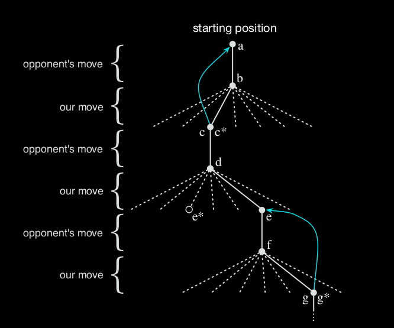
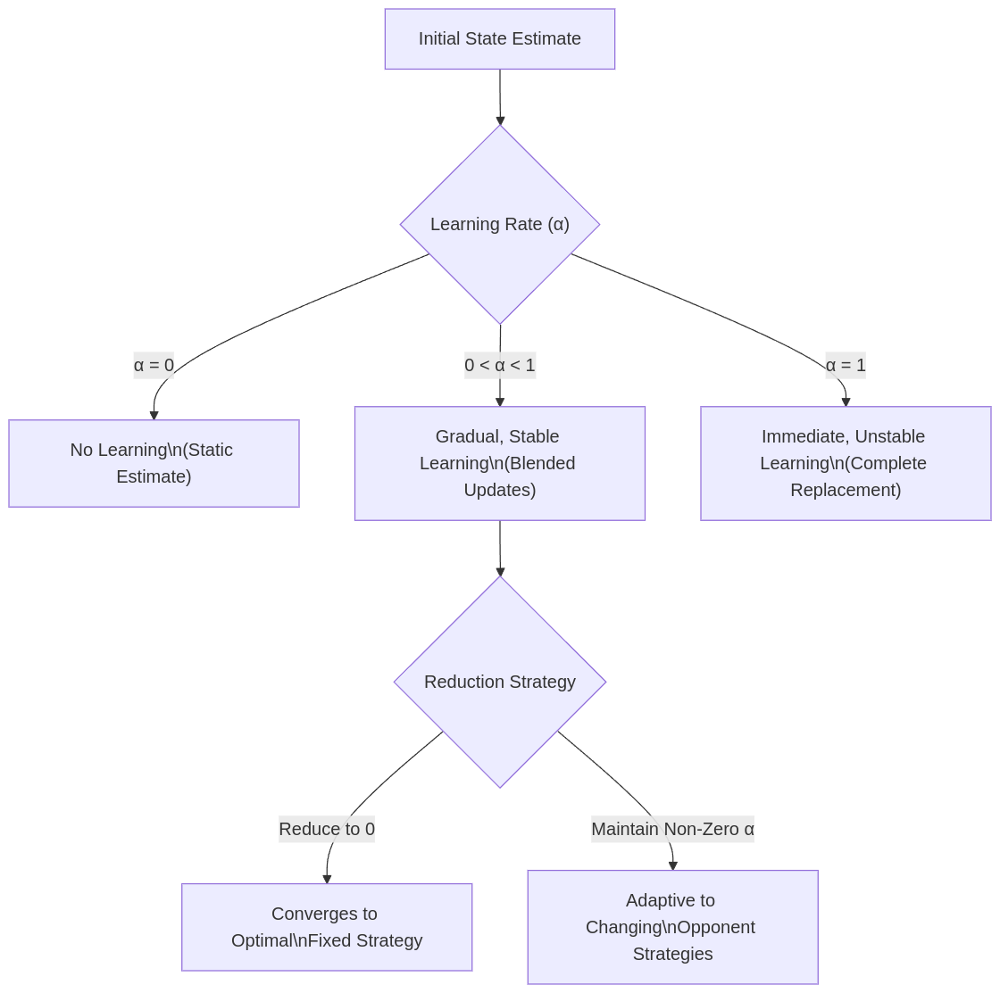

## Reinforcement Learning: Learning from Interactions

* **Learning from Interactions is Key:**  Reinforcement Learning (RL) emphasizes goal-directed learning through interactions with an environment.

* **RL in a Nutshell:** In RL, an agent learns to navigate situations by taking actions to maximize a numerical reward signal.

* **Distinguishing Features of RL:**
    * **Trial and Error Search:** Agents learn through experimentation, trying different actions and observing their consequences.
    * **Delayed Reward:** Actions taken now can influence rewards received in the future. This temporal aspect is crucial.

* **Problems vs. Solutions:** It's important to distinguish between the problems RL aims to solve and the solution approaches used.

### Formalizing the RL Problem: Markov Decision Process (MDP)

* **MDP as a Framework:** The Markov Decision Process (MDP) is used to mathematically formalize the RL problem, representing learning from an environment.
* **MDP Components:** An MDP encompasses sensation (state), action, and a goal (maximizing reward).

### RL Compared to Other Learning Paradigms

* **RL vs. Supervised Learning:**
    * **Supervised Learning:** Relies on "labeled" training data, where the "right answer" is provided. The goal is to learn a mapping from inputs to outputs.
    * **RL:** Learns through interaction and reward, without explicit "correct" actions provided upfront.

* **RL vs. Unsupervised Learning:**
    * **Unsupervised Learning:** Focuses on finding hidden structures in unlabeled data.
    * **RL:**  Aims to maximize a reward signal through actions in an environment, not just finding patterns in data.

### Core Concepts in RL

* **Maximizing Reward Signal:** The fundamental objective of an RL agent is to maximize the cumulative reward received over time.
* **Exploration vs. Exploitation:**
    * **Exploration:** Trying out different actions to discover potentially better strategies.
    * **Exploitation:**  Using currently known best actions to maximize immediate rewards.
    * **Balance is Crucial:**  Neither exploration nor exploitation can be pursued exclusively. An agent must balance trying new things and leveraging what it already knows.
    * **Progressive Favoring:** Agents should progressively favor actions that appear to yield better results based on experience.

* **Goal-Directed Interaction:** RL tackles the complete problem of a goal-directed agent interacting with an uncertain environment.
* **Learning from Experience:** Agents improve their performance over time by learning from their interactions and experiences.

### Key Ingredients of an RL System

* **Policy:**
    * **Definition:** Defines the mapping from perceived states to actions. It dictates the agent's behavior.
    * **Representation:** Can be a function, a lookup table, or involve a search process.
    * **Core Component:** The policy is central to an RL agent, determining its actions in any given situation.
    * **Stochastic Policies:** Policies can be stochastic, meaning they assign probabilities to different actions for a given state.
    * **Conditioned on Situation:** Policies are always conditioned on the agent's current state or situation.

* **Reward Signal:**
    * **Purpose:** Indicates what is "good" in an *immediate* sense.
    * **Stochastic Nature:** Reward signals can be stochastic functions of the environment state and the agent's actions.
    * **Maximization Goal:** The agent aims to maximize the total reward it receives.

* **Value Function:**
    * **Purpose:** Specifies what is "good" in the *long run*. It predicts future rewards.
    * **Definition of Value:** The value of a state is the expected total reward an agent can accumulate over the future, starting from that state.
    * **Long-Term Perspective:** A state with low immediate reward can still have high value if it leads to states with high future rewards.
    * **Action Selection:** In RL, agents should prioritize actions that lead to states of *high value*, not just states with *high immediate reward*.
    * **Value Estimation:** Methods for estimating state values are crucial in RL.

* **Model of the Environment (Optional):**
    * **Purpose:** Represents the environment's dynamics, predicting how the environment will change in response to actions.
    * **Model-Based Methods:** Utilize environment models for planning, which involves considering future situations before experiencing them.  Example: Chess game - simulating moves using a model of the board.
    * **Model-Free Methods:** Do not use an environment model. Rely more on trial-and-error learning. They are opposite to model-based approaches in their reliance on direct experience.

### Spectrum of RL Methods

* **Trial-and-Error Learning to Deliberative Planning:** RL encompasses a spectrum of approaches, ranging from simple trial-and-error methods to sophisticated planning techniques.

### State in RL

* **State Definition:** The state represents whatever information is available to the agent about its environment at a given time.
* **Input to Core Components:** The state serves as input to the policy, value function, and environment model (if used).
* **State Representation:** Designing an effective state representation (state signal) is a critical aspect of RL.

### Example: Tic-Tac-Toe and Temporal Difference Learning

* **Learning State Values:** How do we update state values and learn from experience which states are better?

* **Temporal Difference (TD) Learning:**
    * **Update Rule:**  We adjust the value of the previous state ($S_t$) to be closer to the value of the current state ($S_{t+1}$).
    * **Formula:**
       $$V(S_t) \leftarrow V(S_t) + \alpha [V(S_{t+1}) - V(S_t)]$$
        * $V(S_t)$: Value of the state *before* the move.
        * $V(S_{t+1})$: Value of the state *after* the move.
        * $\alpha$: Step-size parameter (learning rate), a positive fraction that controls the learning rate.
    * **Temporal Difference:** The update is based on the difference between value estimates at two successive time steps, hence "Temporal Difference."
    * **Exploratory Moves and Learning:**  In the context of the Tic-Tac-Toe example, exploratory moves (not necessarily the best moves) are still crucial for learning and updating value estimates.

#### Impact of Learning Rate ($\alpha$) on TD Learning

* **Learning Rate Effect:** The learning rate ($\alpha$) significantly impacts the speed and stability of learning in TD methods.

### Further Considerations in RL

* **Learning and Planning Separation:** Learning and planning are distinct but often intertwined components in more advanced RL systems.
* **Beyond Episodic Tasks:** RL is not limited to episodic tasks (tasks with clear start and end). It can also handle continuous tasks.
* **Neural Networks for Generalization:** Integrating Artificial Neural Networks into RL can enable generalization from experience. This allows agents to make informed decisions in new, unseen states based on knowledge learned from similar past states.
* **Large State Spaces:** For problems with large state spaces, neural networks are particularly useful for generalization and avoiding the need to explore the entire state space. Supervised learning techniques often play a role in training these neural networks within RL.
* **Models in RL:**
    * **Optional but Powerful:** While not strictly necessary, environment models can be learned and significantly enhance RL agents.
    * **Model-Free Limitations:** Model-free systems are limited in their ability to anticipate future environmental changes resulting from their actions. They primarily react to immediate rewards and learned values.