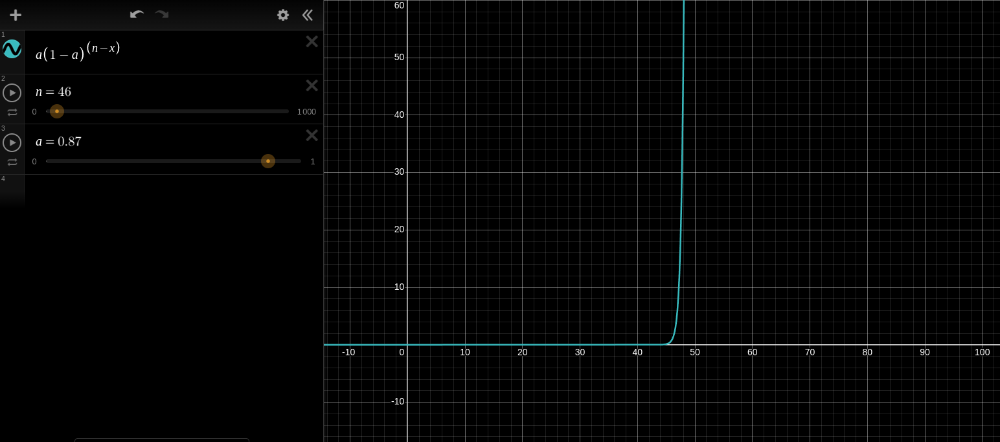

# Chapter 2: Multi-Armed Bandits
* **Optimal Control:**  The problem of designing a controller for a dynamical system to minimize or maximize a measure of its behavior over time.

* **Bellman Equation:** A central equation in dynamic programming and optimal control that provides a recursive relationship for calculating optimal values or policies.

* **Dynamic Programming:** A class of methods for solving optimal control problems using the Bellman equation. It breaks down complex problems into simpler overlapping subproblems.

* **Markov Decision Process (MDP):**  The discrete-time stochastic version of optimal control problems. MDPs provide a mathematical framework for modeling decision-making in situations where outcomes are partly random and partly under the control of a decision-maker.

* **Stochastic Optimal Control:** Optimal control problems where the system dynamics or rewards are stochastic (probabilistic). These problems are often formulated and solved using MDPs.

* **Curse of Dimensionality:** A significant challenge in dynamic programming and related methods. Computational requirements (memory and time) grow exponentially with the number of state variables, making it difficult to apply these methods to high-dimensional problems.

* **Credit Assignment Problem:** A fundamental challenge in reinforcement learning.
    * **Definition:** How to attribute credit or blame for an outcome (e.g., success or failure) to the sequence of actions that led to it, especially when many decisions are involved over time.

* **Temporal Difference (TD) Methods:** A class of reinforcement learning methods that learn by bootstrapping from temporally successive estimates of the *same* value function or quantity. They learn from incomplete episodes and can be used online.

* **Bandit Problems:** A simplified type of reinforcement learning problem where there is only a *single state*. In essence, it's about repeatedly choosing between different actions in the same situation to maximize cumulative reward.

* **Fundamental Methods for Solving MDPs:** There are three main classes of methods, each with its own strengths and weaknesses:

    1. **Dynamic Programming (DP):**
        * **Requires:** A complete and accurate model of the environment (transition probabilities and reward functions).
        * **Pros:** Guaranteed to find the optimal policy if the model is correct and computational resources are sufficient.
        * **Cons:** Suffers from the curse of dimensionality; computationally expensive for large state spaces; requires a model, which is not always available in real-world problems.

    2. **Monte Carlo (MC) Methods:**
        * **Requires:** No model of the environment (model-free).
        * **Pros:** Simple to understand and implement; can learn directly from experience without needing a model.
        * **Cons:** Not well-suited for step-by-step incremental computation; typically requires complete episodes to learn; can have high variance.

    3. **Temporal Difference (TD) Learning:**
        * **Requires:** No model of the environment (model-free).
        * **Pros:** Fully incremental (can learn online, step-by-step); doesn't require complete episodes; typically lower variance than Monte Carlo methods.
        * **Cons:** Can be more complex to analyze theoretically compared to Monte Carlo methods; can be sensitive to step-size parameters.

    * **Summary:** These methods differ in their model requirements, computational efficiency, speed of convergence, and suitability for different types of problems.

* **Combining Strengths:**
    * **Multi-step Bootstrapping:**  The strengths of Monte Carlo methods (no model, simplicity) can be combined with Temporal Difference methods (incremental learning, lower variance) through multi-step bootstrapping techniques (like TD($\lambda$)).
    * **Model Learning and Planning:** Temporal difference learning can be integrated with model learning (estimating a model from experience) and planning methods (like dynamic programming using the learned model) to create a more complete and unified solution for reinforcement learning problems, especially in tabular settings.

 

## Multi-Armed Bandits

* **Reinforcement Learning vs. Supervised Learning:**  In reinforcement learning, training information is used to *evaluate* the actions taken (how good was the action?) rather than to *instruct* by providing the correct actions (as in supervised learning).

* **Evaluative Feedback:**  RL agents receive evaluative feedback in the form of rewards, indicating the quality of their actions, but not necessarily telling them the best action to take.

* **Exploration Encouraged:**  The evaluative nature of feedback encourages RL algorithms to actively explore different actions to discover better behaviors and maximize cumulative reward.

* **Non-Associative Setting:** A simplified setting where the agent does not need to learn different actions in different situations. This implies that the state remains constant or is not relevant to the decision-making process. Bandit problems typically operate in a non-associative setting.

* **Focus on Evaluative Feedback:** In non-associative settings (like bandit problems), the agent relies purely on evaluative feedback (rewards) without considering the context or situation in which the agent finds itself.

* **Stationary Probability Distribution:**  In the context of bandit problems, it means that the probability distribution of rewards for each action remains constant over time. The underlying reward mechanism doesn't change.

### k-Armed Bandit Problem

* **Problem Description:** You are repeatedly faced with a choice among *k* different options (arms/actions). Each action, when selected, yields a reward drawn from a stationary probability distribution specific to that action.

* **Objective:** Maximize the expected *total* reward over some time period (e.g., over a sequence of action selections).

* **Exploitation vs. Exploration:** To achieve the objective, you need to balance:
    * **Exploitation:**  Concentrating action selections on the options (arms) that are currently believed to be the best (highest expected reward).
    * **Exploration:** Trying out different options, including those that are currently believed to be suboptimal, to gather more information and potentially discover even better options in the long run.

* **Action Value (True Value):**  The *true* value of an action *a*, denoted as $q_*(a)$, is the expected reward when action *a* is selected. It is defined as:

$$  
q_*(a) \doteq \mathbb{E}[R_t \mid A_t = a]  
$$  

 Where:
 
 $q_*(a)$ is the true value (expected reward) of action $a$.
 
 $\mathbb{E}[\cdot]$ denotes the expected value.
 
 $R_t$ is the reward received at time step $t$.
 
 $A_t$ is the action taken at time step $t$.
 
 The notation $\doteq$ means "defined as" or "approximately equal to" in this context of definition.

* **Estimated Action Value:** The *estimated* value of action *a* at time step *t* is denoted as $Q_t(a)$.  The goal of learning is to make $Q_t(a)$ as close as possible to the true value $q_*(a)$.

* **Greedy Action Selection (Exploitation):** Choosing the action with the currently highest estimated value.  This rule is defined as:

 $$
 A_t \doteq \arg\max_a Q_t(a)
 $$

 * $\arg\max_a$ means selecting the action *a* that maximizes the expression $Q_t(a)$.

* **Exploration Benefits:** Choosing non-greedy actions (exploration) allows you to improve your estimates of the values of less-explored actions, which can lead to the discovery of better actions and greater cumulative reward in the long run.

* **Exploration vs. Exploitation Trade-off:** The optimal balance between exploration and exploitation depends on factors like:
    1. **Action value estimates:** How confident you are in your current value estimates.
    2. **Uncertainties:** How much uncertainty there is about the true values of actions.
    3. **Number of remaining steps:** How many more action selections you have left.

* **Balancing Exploration and Exploitation:**  Various strategies exist to balance these two competing objectives.

### Action-Value Methods

* **Core Idea:** Methods that estimate the values of actions and use these estimates to make action selection decisions.

* **Sample-Average Method for Estimating Action Values:** A simple method to estimate the value of an action *a*. It averages the rewards received after taking action *a* in the past:

$$
Q_t(a) \doteq \frac{\text{sum of rewards when } a \text{ taken prior to } t}{\text{number of times } a \text{ taken prior to } t} = \frac{\sum_{i=1}^{t-1} R_i \cdot \mathbb{1}_{A_i=a}}{\sum_{i=1}^{t-1}\mathbb{1}_{A_i=a}}
$$

Where:
 
$\mathbb{1}_{A_i=a}$ is an indicator function that is 1 if action $A_i$ was equal to $a$, and 0 otherwise.

* **Law of Large Numbers:** As the number of times action *a* is taken approaches infinity (denominator goes to infinity), the estimated value $Q_t(a)$ converges to the true value $q_*(a)$.

### $\epsilon$-Greedy Action Selection

* **$\epsilon$-Greedy Strategy:** A simple way to balance exploration and exploitation.
    * With a small probability $\epsilon$ (epsilon), select a random action from among all possible actions with equal probability (exploration).
    * Otherwise (with probability $1 - \epsilon$), select the greedy action (exploitation) - the action with the highest estimated value.

* **Near-Greedy:** $\epsilon$-greedy is considered a "near-greedy" approach because it mostly acts greedily but occasionally explores.

* **Benefit of $\epsilon$-Greedy (Convergence in the Limit):**  In the long run (as the number of steps increases), $\epsilon$-greedy ensures that every action will be sampled infinitely many times (if $\epsilon > 0$). This guarantees that all estimated action values $Q_t(a)$ will eventually converge to their respective true values $q_*(a)$. This convergence property is important for finding optimal policies in the long run.

##### 10-armed Testbed

* Multi-armed bandit problems are used to study the effects of exploration vs. exploitation. In this scenario, you have multiple actions, and each action initially has an unknown mean and standard deviation for its reward distribution. Your exploration strategy, such as the $\epsilon$-greedy approach, is crucial for learning the best actions.

* The multi-armed bandit problem serves as a benchmark to measure the performance and behavior of different learning algorithms, particularly those dealing with exploration-exploitation trade-offs.

* **Greedy methods perform worse in the long run** because they can get stuck exploiting suboptimal actions early on, without sufficiently exploring other potentially better options.

* **$\epsilon$-greedy methods have a higher chance of finding optimal actions** because the exploration component allows them to discover actions that greedy methods might miss.

* It is beneficial to **reduce $\epsilon$ over time**. This strategy starts with higher exploration initially to discover good actions and then gradually shifts towards exploitation as knowledge improves, leveraging the best of both exploration and exploitation phases.

* The choice between $\epsilon$-greedy and purely greedy methods depends on the specific characteristics of the task:

    1. **High Reward Variance:** If the reward variance is high (e.g., variance of 10), meaning rewards are noisy and fluctuate significantly, more exploration is needed to reliably estimate the true value of each action and find the optimal one.

    2. **Low or Near-Zero Reward Variance:** If the reward variance is low or close to zero (rewards are consistent), a greedy method might quickly identify the true value of each action after trying it just a few times (or even once in a deterministic case).

    3. **Non-Stationary Tasks:** If the task is non-stationary, meaning the true reward distribution of actions changes over time, exploration becomes essential even in deterministic or low-variance scenarios. Actions that were once suboptimal may become optimal, requiring continuous exploration to adapt to these changes.

* **Most real-world Reinforcement Learning problems are non-stationary**, making exploration a critical component of effective learning agents.

 

##### Incremental Implementation

Let's recall our current goal: to **estimate the true action value for the available set of actions** efficiently.

* **Incremental update formulas** for estimating action values are computationally efficient, requiring constant memory and constant computation per time step.  A basic incremental update formula is:

    $$
    Q_{n+1} = Q_n + \frac{1}{n}[R_n - Q_n]
    $$

    *  We can recognize a general pattern in this update rule:

    $$
    \text{NewEstimate} = \text{OldEstimate} + \text{StepSize} \times (\text{Target} - \text{OldEstimate})
    $$

    *  Here, the `Target` is the reward $R_n$. In general, the target represents a desired direction to move the estimate towards.

 

##### Tracking a Non-Stationary Problem

* As previously mentioned, **non-stationary problems** are characterized by changing reward probabilities over time.

* In such dynamic environments, it is crucial to prioritize **recent rewards** over rewards received long ago when updating action value estimates, as older rewards may no longer be relevant to the current action values.

* **Solution 1: Constant Step-Size Parameter**

    * Use a constant step-size parameter, denoted as $\alpha$, to give more weight to recent rewards:

        $$
        Q_{n+1} \doteq Q_n + \alpha(R_n - Q_n)
        $$

        where $\alpha \in (0, 1]$ is a constant.

    * Expanding this recursive formula, we can express $Q_{n+1}$ as a weighted average of past rewards:

        $$
        Q_{n+1} = (1-\alpha)^n Q_1 + \sum_{i=1}^n \alpha(1-\alpha)^{n-i} R_i
        $$

        where the sum of weights is equal to 1:

        $$
        (1-\alpha)^n + \sum_{i=1}^n \alpha(1-\alpha)^{n-i} = 1
        $$

    * The weight assigned to each reward $R_i$, which is $\alpha(1-\alpha)^{n-i}$, depends on how many rewards ago it was observed ($n-i$). Since $0 < (1-\alpha) < 1$, the weight given to $R_i$ **decreases exponentially** as the number of intervening rewards increases.

    * If $i=1$, the reward $R_1$ was received $n-1$ steps ago, and its weight $\alpha(1-\alpha)^{n-1}$ will be relatively low (especially if $n$ is large). If $i=n$, the reward $R_n$ is the most recent reward, and its weight $\alpha(1-\alpha)^{0} = \alpha$ will be the highest among the rewards $R_1, ..., R_n$.

    * **Exponential Recency Weighted Average:** This behavior of prioritizing recent rewards through exponentially decaying weights is known as the **exponential recency weighted average**.

    * **Weight Decay Visualization:**

        
        *As illustrated in the figure, the weight decays exponentially as the rewards become older. If $\alpha$ is close to 1 (making $1-\alpha$ close to 0), almost all the weight is placed on the most recent reward.*

* **Step-size parameter $\alpha$ (or $\alpha_n$):**  Determines how much emphasis to give to newly received rewards when updating the estimated value of an action after the $n^{th}$ selection.

* **Sample Average Method Responsiveness:** As the number of observations increases in the sample average method, it becomes less responsive to new rewards due to the $1/n$ step size, which diminishes over time.

    | Feature                      | Sample Average Method                       | Constant Step-Size Method                               |
    | ---------------------------- | ------------------------------------------- | ------------------------------------------------------- |
    | **Convergence**              | Converges to true value over time (stationary)           | May oscillate, bias can persist (non-stationary)                         |
    | **Responsiveness**           | Slower response to recent data              | Quick adaptation to changes                             |
    | **Bias Reduction**           | Reduces bias over time with sufficient data (stationary) | Bias may persist with poor initial estimates (non-stationary)            |
    | **Stability**                | More stable; less volatile (stationary)                  | More volatile; can diverge (non-stationary)                              |
    | **Computational Efficiency** | Simple and efficient to compute             | Also efficient, but requires careful tuning of $\alpha$ |
    | **Use Case Suitability**     | Best for stationary problems                | Best for non-stationary problems                        |

* **Tuning $\alpha$:** In the constant step-size method, if $\alpha$ is too large, the learner becomes overly sensitive to noise and short-term fluctuations. If $\alpha$ is too small, learning becomes slow, and the agent may not react quickly enough to changes in non-stationary environments.

* **Impact of Initial Estimates:** The sample average method can mitigate the impact of poor initial estimates over many samples. In contrast, the constant step-size method's performance can be more influenced by initial values, as indicated by the $Q_1$ term in the expanded formula, although its influence diminishes over time, it is still present.

* **True Action Value Reiteration:** To reiterate, **True action value** is the actual expected reward for an action in a given state.

* **Key Difference:** In the sample average method, the focus gradually shifts away from initial values as more data is collected. In the constant step-size method, while the influence of $Q_1$ diminishes over time, it is still a component of the estimate, making the choice of initial value and the constant step-size parameter $\alpha$ more important, especially in non-stationary environments.

* To observe the difference between sample average and constant step-size method, review the code in *algorithms/2_5.py* and see the **action_value_methods_performance** plot.

